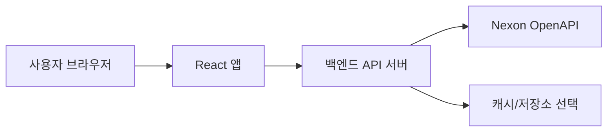

# 메이플스토리 OpenAPI 백엔드 구조

작성 기준: 2026-05-11

이 문서는 Nexon OpenAPI의 메이플스토리 문서 7개를 기준으로, 이 프로젝트에서 백엔드를 붙일 때 어떤 구조로 나누면 좋은지 정리한 설계 메모다.

## 참고한 공식 문서

- 캐릭터 정보 조회: https://openapi.nexon.com/ko/game/maplestory/?id=14
- 유니온 정보 조회: https://openapi.nexon.com/ko/game/maplestory/?id=15
- 길드 정보 조회: https://openapi.nexon.com/ko/game/maplestory/?id=16
- 연무장 정보 조회: https://openapi.nexon.com/ko/game/maplestory/?id=55
- 확률 정보 조회: https://openapi.nexon.com/ko/game/maplestory/?id=17
- 랭킹 정보 조회: https://openapi.nexon.com/ko/game/maplestory/?id=18
- 공지 정보 조회: https://openapi.nexon.com/ko/game/maplestory/?id=24

## 현재 프로젝트와 맞는 방향

현재 프로젝트는 React 프론트에서 `src/api/instance.ts`와 `src/api/character.ts`를 통해 API 호출을 감싼다. Nexon OpenAPI는 요청 헤더에 `x-nxopen-api-key`가 필요하므로, API Key를 브라우저에 노출하지 않으려면 별도 백엔드를 두고 프론트는 백엔드만 호출하는 구조가 안전하다.



## 권장 레이어

- `routes`: 프론트가 호출할 프로젝트 API 경로를 정의한다.
- `controllers`: 요청 파라미터를 검증하고 서비스에 넘긴다.
- `services`: 캐릭터, 유니온, 길드, 랭킹처럼 도메인별 사용 흐름을 만든다.
- `nexonClient`: Nexon OpenAPI 호출을 담당한다. `x-nxopen-api-key`, `prefixUrl`, 공통 에러 처리를 여기로 모은다.
- `cache`: 공지, 랭킹, 확률 이력처럼 자주 바뀌지 않거나 반복 조회가 많은 데이터에 선택적으로 붙인다.
- `types`: Nexon 응답 타입과 프론트로 내려줄 DTO 타입을 분리한다.

## 프론트와 백엔드 경계

프론트는 현재처럼 `getOcid`, `getChar`, `getEquipment` 같은 함수명을 유지해도 된다. 다만 호출 대상은 Nexon 원본이 아니라 프로젝트 백엔드로 바꾼다.

예시:

```text
GET /api/maplestory/characters/:characterName/summary
```

백엔드는 내부에서 다음 순서로 처리한다.

1. `/maplestory/v1/id`로 `character_name`을 `ocid`로 변환한다.
2. `/maplestory/v1/character/basic`으로 기본 정보를 조회한다.
3. 필요한 화면에 맞춰 장비, 캐시 장비, 뷰티 정보를 병렬 조회한다.
4. 프론트가 바로 쓰기 좋은 응답으로 합쳐서 내려준다.

## Nexon API 그룹

### 캐릭터 정보 조회

주요 식별자는 `ocid`다. 캐릭터명으로 직접 대부분의 정보를 조회하지 않고, 먼저 `ocid`를 얻은 뒤 상세 API를 호출한다.

| 용도                    | Nexon 엔드포인트                                             | 필수 파라미터                   | 선택 파라미터 |
| ----------------------- | ------------------------------------------------------------ | ------------------------------- | ------------- |
| 캐릭터 목록             | `GET /maplestory/v1/character/list`                          | -                               | -             |
| 계정 업적               | `GET /maplestory/v1/user/achievement`                        | -                               | -             |
| 캐릭터명으로 ocid 조회  | `GET /maplestory/v1/id`                                      | `character_name`                | -             |
| 기본 정보               | `GET /maplestory/v1/character/basic`                         | `ocid`                          | `date`        |
| 인기도                  | `GET /maplestory/v1/character/popularity`                    | `ocid`                          | `date`        |
| 종합 능력치             | `GET /maplestory/v1/character/stat`                          | `ocid`                          | `date`        |
| 하이퍼스탯              | `GET /maplestory/v1/character/hyper-stat`                    | `ocid`                          | `date`        |
| 성향                    | `GET /maplestory/v1/character/propensity`                    | `ocid`                          | `date`        |
| 어빌리티                | `GET /maplestory/v1/character/ability`                       | `ocid`                          | `date`        |
| 장착 장비               | `GET /maplestory/v1/character/item-equipment`                | `ocid`                          | `date`        |
| 캐시 장비               | `GET /maplestory/v1/character/cashitem-equipment`            | `ocid`                          | `date`        |
| 심볼                    | `GET /maplestory/v1/character/symbol-equipment`              | `ocid`                          | `date`        |
| 세트 효과               | `GET /maplestory/v1/character/set-effect`                    | `ocid`                          | `date`        |
| 헤어/성형/피부          | `GET /maplestory/v1/character/beauty-equipment`              | `ocid`                          | `date`        |
| 안드로이드              | `GET /maplestory/v1/character/android-equipment`             | `ocid`                          | `date`        |
| 펫                      | `GET /maplestory/v1/character/pet-equipment`                 | `ocid`                          | `date`        |
| 스킬                    | `GET /maplestory/v1/character/skill`                         | `ocid`, `character_skill_grade` | `date`        |
| 링크 스킬               | `GET /maplestory/v1/character/link-skill`                    | `ocid`                          | `date`        |
| V매트릭스               | `GET /maplestory/v1/character/vmatrix`                       | `ocid`                          | `date`        |
| HEXA 코어               | `GET /maplestory/v1/character/hexamatrix`                    | `ocid`                          | `date`        |
| HEXA 스탯               | `GET /maplestory/v1/character/hexamatrix-stat`               | `ocid`                          | `date`        |
| 무릉 최고 기록          | `GET /maplestory/v1/character/dojang`                        | `ocid`                          | `date`        |
| 기타 능력치 영향 요소   | `GET /maplestory/v1/character/other-stat`                    | `ocid`                          | `date`        |
| 링 익스체인지 스킬 장비 | `GET /maplestory/v1/character/ring-exchange-skill-equipment` | `ocid`                          | `date`        |
| 예비 특수 반지 장착     | `GET /maplestory/v1/character/ring-reserve-skill-equipment`  | `ocid`                          | `date`        |

### 유니온 정보 조회

유니온은 캐릭터의 `ocid`를 기준으로 계정 단위 정보를 조회한다.

| 용도            | Nexon 엔드포인트                         | 필수 파라미터 | 선택 파라미터 |
| --------------- | ---------------------------------------- | ------------- | ------------- |
| 유니온 정보     | `GET /maplestory/v1/user/union`          | `ocid`        | `date`        |
| 유니온 공격대   | `GET /maplestory/v1/user/union-raider`   | `ocid`        | `date`        |
| 유니온 아티팩트 | `GET /maplestory/v1/user/union-artifact` | `ocid`        | `date`        |
| 유니온 챔피언   | `GET /maplestory/v1/user/union-champion` | `ocid`        | `date`        |

### 길드 정보 조회

길드는 `guild_name`과 `world_name`으로 `oguild_id`를 얻은 뒤 상세 정보를 조회한다.

| 용도             | Nexon 엔드포인트                 | 필수 파라미터              | 선택 파라미터 |
| ---------------- | -------------------------------- | -------------------------- | ------------- |
| 길드 식별자 조회 | `GET /maplestory/v1/guild/id`    | `guild_name`, `world_name` | -             |
| 길드 기본 정보   | `GET /maplestory/v1/guild/basic` | `oguild_id`                | `date`        |

### 연무장 정보 조회

연무장은 `ocid`로 리플레이 식별자를 찾고, 이후 `replay_id`를 기준으로 결과와 타임라인을 조회한다.

| 용도                | Nexon 엔드포인트                                    | 필수 파라미터 | 선택 파라미터 |
| ------------------- | --------------------------------------------------- | ------------- | ------------- |
| 리플레이 식별자     | `GET /maplestory/v1/battle-practice/replay-id`      | `ocid`        | -             |
| 측정 결과           | `GET /maplestory/v1/battle-practice/result`         | `replay_id`   | -             |
| 스킬 사용 내역      | `GET /maplestory/v1/battle-practice/skill-timeline` | `replay_id`   | `page_no`     |
| 입장 시 캐릭터 정보 | `GET /maplestory/v1/battle-practice/character-info` | `replay_id`   | -             |

### 확률 정보 조회

확률 이력은 계정 식별자와 페이지성 조회가 중심이다. `count`는 필수이며, `date` 또는 `cursor` 중 하나 이상이 필요하다.

| 용도                         | Nexon 엔드포인트                       | 필수 파라미터 | 선택 파라미터    |
| ---------------------------- | -------------------------------------- | ------------- | ---------------- |
| 계정 식별자 조회, 구 API Key | `GET /maplestory/legacy/ouid`          | -             | -                |
| 계정 식별자 조회             | `GET /maplestory/v1/ouid`              | -             | -                |
| 스타포스 강화 결과           | `GET /maplestory/v1/history/starforce` | `count`       | `date`, `cursor` |
| 잠재능력 재설정 결과         | `GET /maplestory/v1/history/potential` | `count`       | `date`, `cursor` |
| 큐브 사용 결과               | `GET /maplestory/v1/history/cube`      | `count`       | `date`, `cursor` |

### 랭킹 정보 조회

랭킹은 대부분 `date`가 필수다. 화면에서 필터를 많이 다루므로 백엔드에서 허용 파라미터를 명확히 검증하는 편이 좋다.

| 용도          | Nexon 엔드포인트                         | 필수 파라미터          | 선택 파라미터                                       |
| ------------- | ---------------------------------------- | ---------------------- | --------------------------------------------------- |
| 종합 랭킹     | `GET /maplestory/v1/ranking/overall`     | `date`                 | `world_name`, `world_type`, `class`, `ocid`, `page` |
| 유니온 랭킹   | `GET /maplestory/v1/ranking/union`       | `date`                 | `world_name`, `ocid`, `page`                        |
| 길드 랭킹     | `GET /maplestory/v1/ranking/guild`       | `date`, `ranking_type` | `world_name`, `guild_name`, `page`                  |
| 무릉도장 랭킹 | `GET /maplestory/v1/ranking/dojang`      | `date`, `difficulty`   | `world_name`, `class`, `ocid`, `page`               |
| 더 시드 랭킹  | `GET /maplestory/v1/ranking/theseed`     | `date`                 | `world_name`, `ocid`, `page`                        |
| 업적 랭킹     | `GET /maplestory/v1/ranking/achievement` | `date`                 | `ocid`, `page`                                      |

### 공지 정보 조회

공지 목록은 최근 20개를 반환한다. Nexon 문서에서는 신규/수정 공지 반영을 위해 실시간 조회 또는 최소 일배치 갱신을 권장한다.

| 용도                | Nexon 엔드포인트                            | 필수 파라미터 | 선택 파라미터 |
| ------------------- | ------------------------------------------- | ------------- | ------------- |
| 공지사항 목록       | `GET /maplestory/v1/notice`                 | -             | -             |
| 공지사항 상세       | `GET /maplestory/v1/notice/detail`          | `notice_id`   | -             |
| 업데이트 목록       | `GET /maplestory/v1/notice-update`          | -             | -             |
| 업데이트 상세       | `GET /maplestory/v1/notice-update/detail`   | `notice_id`   | -             |
| 진행 중 이벤트 목록 | `GET /maplestory/v1/notice-event`           | -             | -             |
| 진행 중 이벤트 상세 | `GET /maplestory/v1/notice-event/detail`    | `notice_id`   | -             |
| 캐시샵 공지 목록    | `GET /maplestory/v1/notice-cashshop`        | -             | -             |
| 캐시샵 공지 상세    | `GET /maplestory/v1/notice-cashshop/detail` | `notice_id`   | -             |

## 프로젝트 백엔드 API 예시

Nexon API를 그대로 프론트에 노출하기보다, 화면 단위로 묶은 프로젝트 API를 제공한다.

| 프로젝트 API                                            | 내부에서 호출할 Nexon API                                                                                              |
| ------------------------------------------------------- | ---------------------------------------------------------------------------------------------------------------------- |
| `GET /api/maplestory/characters/:characterName/summary` | `/id`, `/character/basic`, `/character/item-equipment`, `/character/cashitem-equipment`, `/character/beauty-equipment` |
| `GET /api/maplestory/characters/:characterName/union`   | `/id`, `/user/union`, `/user/union-raider`, `/user/union-artifact`, `/user/union-champion`                             |
| `GET /api/maplestory/guilds/:worldName/:guildName`      | `/guild/id`, `/guild/basic`                                                                                            |
| `GET /api/maplestory/rankings/overall`                  | `/ranking/overall`                                                                                                     |
| `GET /api/maplestory/notices`                           | `/notice`, `/notice-update`, `/notice-event`, `/notice-cashshop`                                                       |
| `GET /api/maplestory/notices/:type/:noticeId`           | 각 공지 상세 API                                                                                                       |

## 에러 처리 기준

- `400`: 프론트에서 보낸 파라미터가 잘못된 경우로 보고 입력값 안내 메시지를 내려준다.
- `403`: API Key 문제 또는 권한 문제다. 백엔드 로그에는 남기되 프론트에는 일반적인 서버 설정 오류로 내려준다.
- `429`: 호출량 제한이다. 캐시를 우선 사용하거나 잠시 후 재시도 안내를 내려준다.
- `500`: Nexon 또는 백엔드 내부 오류다. 원본 에러 메시지를 그대로 노출하지 않는다.

## 캐시 기준

- 캐릭터 기본/장비/유니온: 캐릭터 검색 화면에서는 짧은 TTL을 둔다.
- 랭킹: 날짜 단위 조회가 많으므로 `date + filter + page`를 키로 캐시한다.
- 공지: 목록은 주기적으로 갱신하고, 상세는 `notice_id` 기준으로 캐시한다.
- 확률 이력: `date`/`cursor` 페이지 단위 캐시를 고려한다.

## 환경 변수

백엔드에는 최소한 다음 환경 변수가 필요하다.

```text
NEXON_OPEN_API_BASE_URL=https://open.api.nexon.com
NEXON_OPEN_API_KEY=서버에서만 사용하는 Nexon API Key
```

프론트의 `VITE_API_URL`은 Nexon 원본 주소가 아니라 프로젝트 백엔드 주소를 가리키는 편이 안전하다.
